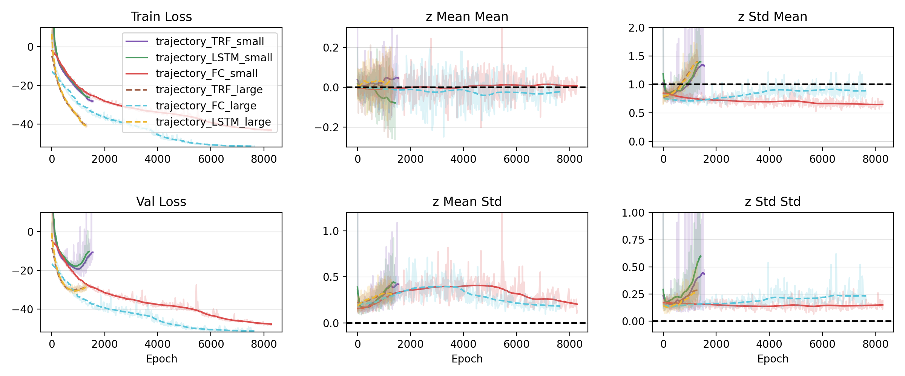

<h1 align="center">
    
</h1>


<h1 align="center" style="margin-top: 0px;">BCNF: Ballistic Conditional Normalizing Flows</h1>
<h2 align="center" style="margin-top: 0px;">Generative Neural Networks for the Sciences: Final Project</h2>

<div align="center">

[](https://github.com/psaegert/bcnf/actions/workflows/pytest.yml)
[](https://github.com/psaegert/bcnf/actions/workflows/pre-commit.yml)

</div>


# Introduction
Conditional Normalizing Flows (CNF) [[1]](https://arxiv.org/abs/1605.08803) [[2]](https://arxiv.org/abs/1410.8516) have achieved major advancements at solving inverse problems [[3]](https://arxiv.org/abs/1808.04730) and performing Amortized Simulation Based Inference [[4]](https://arxiv.org/abs/2312.05440) [[3]](https://arxiv.org/abs/1808.04730) [[5]](https://arxiv.org/abs/2003.06281). Motivated by the idea of exploring physical systems with relevant practical applications, we apply various variations of the CNF architecture with LSTM, Transformer-based and Convolutional feature networks on a family of simulated and real physical systems with ballistic properties, and evaluate our method with regards to log likelihood, calibration and resimulation. Our experiments show that various simulation parameters can be identified from 3D trajectory data with good precision and fair accuracy, but barely at all from rendered or real-world video data.

# Results

| Model                         | Train      | Validation | Test    |
|-------------------------------|------------|------------|---------|
| `trajectory_FC_large`         | **-51.52** | **-51.51** | **-53.19** |
| `trajectory_LSTM_large`      | -45.82     | -34.70     | -35.32  |
| `trajectory_TRF_large`       | -41.21     | -28.87     | -29.12  |
| `trajectory_FC_small`         | -45.71     | -50.69     | -50.80  |
| `trajectory_LSTM_small`      | -42.77     | -45.83     | -46.41  |
| `trajectory_TRF_small`       | -41.71     | -45.06     | -46.11  |

**Table**: **Negative Log Likelihood of the Training, Validation, and Test Set in the Trajectory Setting.** The trajectory data is input into a fully connected (FC) Long Short-Term Memory (LSTM) or Transformer (TRF) feature network.

---



**Figure**: **Metrics during Training of the Trajectory Models.** We show the training and validation loss (left), statistics of the mean (middle) and standard deviation (right) of the validation code distribution in each dimension during training of our method with a small (solid lines) and large (colored dashed lines) CNF. Every model except the two using a fully connected feature network (red solid line, blue dashed line) exhibit overfitting behavior. Ideally, all means in z space converge to 0 and standard deviations to 1 with no variation across the dimensions (black dashed lines). All metrics are logged with the W&B logging provided by Nikita.

---


**Figure**: **Resimulated Trajectories with Parameters Sampled by `trajectory_LSTM_large`**. We show the ground-truth (red curve) and 500 resimulated (faint black curves) for six arbitrarily chosen instances from our test set. The point of impact is calculated by the (first) intersection of the simulated trajectory with the ground ($z$ = 0, green area). Units in Meters.

---


**Figure**: **Predicted Point of Impact Distribution for `trajectory_LSTM_large`**. Many impact distributions (heatmap) match well with the ground truth impact (center point of the white circle). Some predictions significantly deviate from the ground truth impact (Trajectory #5, #10). Units in Meters.


For more results, please see the [results](results) folder.


# Requirements

## Hardware
- 32GB RAM
- CUDA-enabled GPU with 16GB VRAM (recommended)

## Software
- Python 3.11
- `pip` >= [21.3](https://pip.pypa.io/en/stable/news/#v21-3)

# Getting Started
## 1. Clone the repository

```sh
git clone https://github.com/MrWhatZitToYaa/IGNNS-final-project
cd IGNNS-final-project
```

## 2. Install the package

Optional: Create a virtual environment:

**conda:**

```sh
conda create -n bcnf python=3.11 [ipykernel]
conda activate bcnf
```

**venv:**

```bash
python3 -m venv bcnf_venv
source bcnf_venv/bin/activate
```

Then, install the package via

```sh
pip install -e .
```

# Usage

For pretrained models and data, please refer to our [bcnf-models](https://huggingface.co/BCNF/bcnf-models) and [bcnf-data-public](https://huggingface.co/datasets/BCNF/bcnf-data-public) repositories on Hugging Face.

## Load a model from a configuration file:
[calibration.ipynb](./notebooks/calibration.ipynb)
```python
import os
import json
import torch
from bcnf import CondRealNVP_v2

MODEL_NAME = "trajectory_LSTM_large"

# Load the config
with open(os.path.join(get_dir('models', 'bcnf-models', MODEL_NAME), 'config.json'), 'r') as f:
    config = load_config(json.load(f)['config_path'])

# Load the model
model = CondRealNVP_v2.from_config(config).to(device)
cnf.load_state_dict(torch.load(os.path.join(get_dir('models', 'bcnf-models', MODEL_NAME), "state_dict.pt")))
cnf.eval()
```

## Train your own model:

From the command line:
```sh
bcnf train -c configs/runs/trajectory_LSTM_large.yaml
```

In your own code:\
[train.ipynb](./notebooks/train.ipynb)
```python
from bcnf.utils import get_dir, load_config, sub_root_path
from bcnf.train import Trainer
from bcnf import CondRealNVP_v2

# Specify a path template for the config file
config_path_pattern = os.path.join("{{BCNF_ROOT}}", "configs", "runs", "my_config.yaml")

# Find the config file in the local filesystem
config_path = sub_root_path(config_path_pattern)

# Load the config and create a model
config = load_config(config_path, verify=False)
model = CondRealNVP_v2.from_config(config).to(device)

# Create a Trainer instance and load the data specified in the config
trainer = Trainer(
    config={k.lower(): v for k, v in config.to_dict().items()},
    project_name="bcnf-test",  # Name of the Weights & Biases project
    parameter_index_mapping=model.parameter_index_mapping,
    verbose=True,
)

# Train
model = trainer.train(model)

# Save
torch.save(model.state_dict(), os.path.join(get_dir('models', 'bcnf-models', MODEL_NAME, create=True), f"state_dict.pt"))

with open(os.path.join(get_dir('models', 'bcnf-models', MODEL_NAME, create=True), 'config.json'), 'w') as f:
    json.dump({'config_path': config_path_pattern}, f)
```

# Development

## Setup
To set up the development environment, run the following commands:

```sh
pip install -e .[dev]
pre-commit install
```

## Tests

To run the tests locally, run the following commands:

```sh
pytest tests --cov src
```

# Citation
```bibtex
@software{bcnf2024,
    author = {Christian Kleiber and Paul Saegert and Nikita Tatsch},
    title = {BCNF: Ballistic Conditional Normalizing Flows},
    month = mar,
    year = 2024,
    publisher = {GitHub},
    version = {0.1.0},
    url = {https://github.com/MrWhatZitToYaa/IGNNS-final-project}
}
```